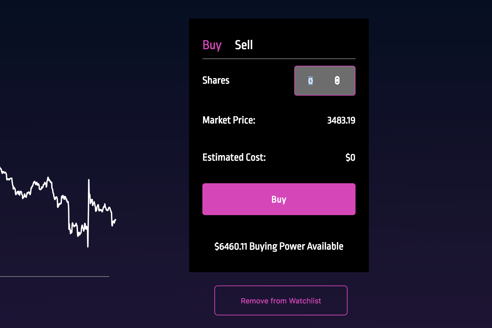

# README
## CryptoNight
[Live Site](https://crypto-night.herokuapp.com)


## About
This project is a full-stack, single-page Cryptocurrency investment app inspired by Robinhood Crypto, and contains design elements from both Robinhood and Robinhood Crypto.

## Technologies
React/Redux front-end

Ruby on Rails backend with PostgreSQL database

Recharts library for data graphing

Cryptocompare API

HTML5 and CSS3 for styling

## Features and Implementation
#### Cryptocurrencies index & sorting

Sends request to Rails backend in order to find list of cryptocurrencies available in database. Concatenates all cryptocurrencies' symbols and fires off one blanket Ajax request for all currencies' price data to cryptocompare API. Does this on an interval of 10 seconds, fetching live prices from the API as often as allowed.

Using local state to toggle the four parameter headings (Name, Symbol, Price, Today), toggles styling and onClick functions for each. OnClick fires off an action that sorts entire list by given parameter. This sorting does not interfere with the interval set and prices will continue live updating.

Useful for parsing cryptocurrencies by overall price or see which ones are rising and falling the fastest. Cryptocurrencies can be added to the list by simply adding to the ```Stocks``` table a cryptocurrency object with a 3 letter symbol.

#### Search by crypto name/symbol

Implemented a searchbar that queries database on either matching symbol or cryptocurrency name. Iterates over search results and toggles styling depending on matching letters entered, mimicking Robinhood searchbar. This results in intuitive and responsive UX.

Future todos include debouncing in order to minimize querying.

#### Cryptocurrency historical data chart

Chains multiple Ajax requests to cryptocompare API to obtain the different timescales of historical data for the visited cryptocurrency. Utilizes Recharts react library to display the data in a visually appealing chart. Timescales can be toggled, switching out the dataset.

The entire page's theme, including link styling and background gradient, are toggled based on the active timescale's trend, with help from React's state change re-rendering. For example, if Bitcoin has decreased in the past 24 hours, the 1D timescale will have a dark purple color scheme. If 5Y is clicked, and Bitcoin has an upwards trend, the color theme will be swapped out for a light green instead.


#### Cryptocurrency related news
Fires of an Ajax request to cryptocompare API to fetch related news based on visited cryptocurrencies' symbol. Iterates over the listings and displays them as links with calculations to display how long ago the news article was published.

#### Buy/Sell Cryptocurrency
Transactions are held in the ```Trasactions``` table. Users can make transactions if they have enough funds to. Users on the ```Users``` table have a funds attribute. On signup, a transaction is created giving a new user one Bitcoin. The user can sell this Bitcoin in a transaction in order to receive funds to make other purchases and trades.

Estimated cost is displayed in the buy/sell table. This is linked to the fetched stock price and is fetched on an interval of 10 seconds. This means that all transactions are based on live market data up to 10 second accuracy, so users can simulate real cryptocurrency trading.

Toggling buy/sell changes the amount in the transaction from a positive number to a negative number. Shares are calculated by summing up all transactions in a user's transaction history.



#### Login/Signup (user authentication)
